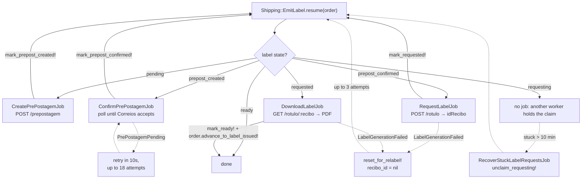
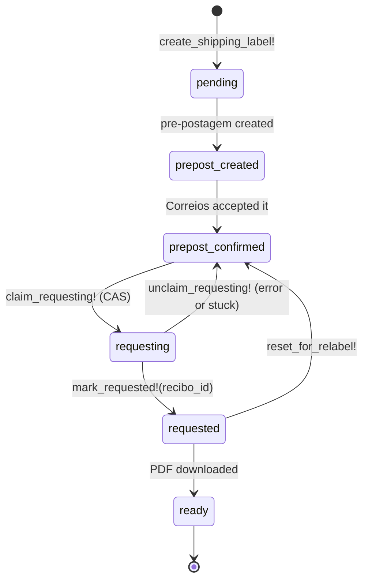
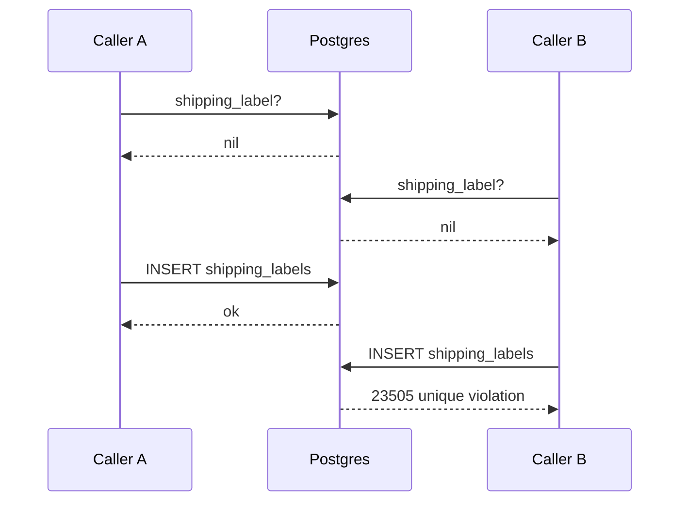

# Label emission flow

How a paid order becomes a printable Correios label, and where the concurrency guards sit.

Entry point is always `Shipping::EmitLabel.resume(order)`. It is deliberately a **resume**, not a start: it reads the label's current state and enqueues the one job that moves it forward. Calling it repeatedly is how the pipeline advances, and every step calls it again when it finishes.

## The pipeline



## Label states



## Who calls resume

Seven places, which is why concurrency is not exotic here:

| Caller | Trigger |
| --- | --- |
| `Admin::LabelsController#create` | operator emits one label, synchronous |
| `Shipping::EmitLabelsJob` | operator emits a batch, or `Admin::BulkTransition` |
| `Shipping::ConfirmPrePostagemJob` | after confirming |
| `Shipping::LabelStep` | after every request and download step |
| `Shipping::RecoverStuckLabelRequestsJob` | hourly at minute 30, via `recover` |

## Correios semantics: only the last request is valid

Correios treats a repeated `rotulo` request for the same pré-postagem as replacing the previous one. **The last request wins and earlier `idRecibo` values stop being valid.**

The pipeline is built around that, in two ways:

1. **One recibo is stored, always the latest.** `recibo_id` is a single column, `mark_requested!` overwrites it, and `DownloadLabelJob` downloads whatever is in it. There is no history to get stale.
2. **Relabelling deliberately discards the old one.** `reset_for_relabel!` nulls `recibo_id` and drops back to `prepost_confirmed`, so the next pass requests a fresh label. That is the intended use of the Correios behaviour, not an accident.

On top of that, the request step does **not** rely on last-write-wins to stay correct. It elects a single requester with a compare-and-swap:

```ruby
def claim_requesting!
  claimed = self.class.where(id: id, state: :prepost_confirmed)
                .update_all(state: :requesting, requesting_at: Time.current)
  reload
  claimed == 1
end
```

`update_all` returns the number of rows it changed, so exactly one concurrent caller sees `1`. Everyone else sees `0`, and `RequestLabelJob#run` returns before touching Correios. So the normal concurrent case is **first one wins, the rest stand down**, and the "last one wins" semantics is what makes the relabel and recovery paths safe rather than what the happy path depends on.

## Where the duplicate-label bug was

`resume` used to open with:

```ruby
label = shipment.shipping_label || shipment.create_shipping_label!
```

That is a check-then-write against the unique index on `shipping_labels.shipment_id`. Two of the seven callers overlapping on one order both read "no label" and both insert, and the loser raises `ActiveRecord::RecordNotUnique`. It happened in production on 2026-07-23 at 13:12 on shipment 29.



Note this sits **before** any Correios call, at the creation of our own row. It never produced two label requests, because the `claim_requesting!` CAS guards that separately.

The fix adopts the winner's row instead of dying:

```ruby
def self.label_for(shipment)
  shipment.shipping_label || shipment.create_shipping_label!
rescue ActiveRecord::RecordNotUnique
  shipment.reload.shipping_label
end
```

Correct either way: the caller wants a label to route on, not specifically the one it created.

`Shipping::EmitLabelsJob` made the same bug far worse. It had no `retry_on` and called `resume` inline while iterating with `find_each`, so one violation propagated out of the loop and every order after the failing one was silently skipped. It now fans out one `Shipping::EmitLabelJob` per order, so a bad order fails and retries alone.

## Known residual risk

`RecoverStuckLabelRequestsJob` unclaims a `requesting` label after 10 minutes. If the original request was merely slow rather than dead, both can finish:

1. Job A claims, calls Correios, stalls.
2. Ten minutes later recovery unclaims and a fresh Job B claims, gets `recibo_B`, and stores it.
3. Job A finally returns `recibo_A` and `mark_requested!` overwrites `recibo_B` with the **older** recibo.

Correios considers `recibo_B` the valid one, so the download would then fetch an invalidated label. `mark_requested!` writes unconditionally, so nothing rejects the late write. Guarding it the same way as the claim (`where(id: id, state: :requesting)`) would close it. Narrow, and not observed in production, but it is the one place where the "last request wins" rule and our stored state can disagree.
