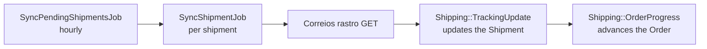
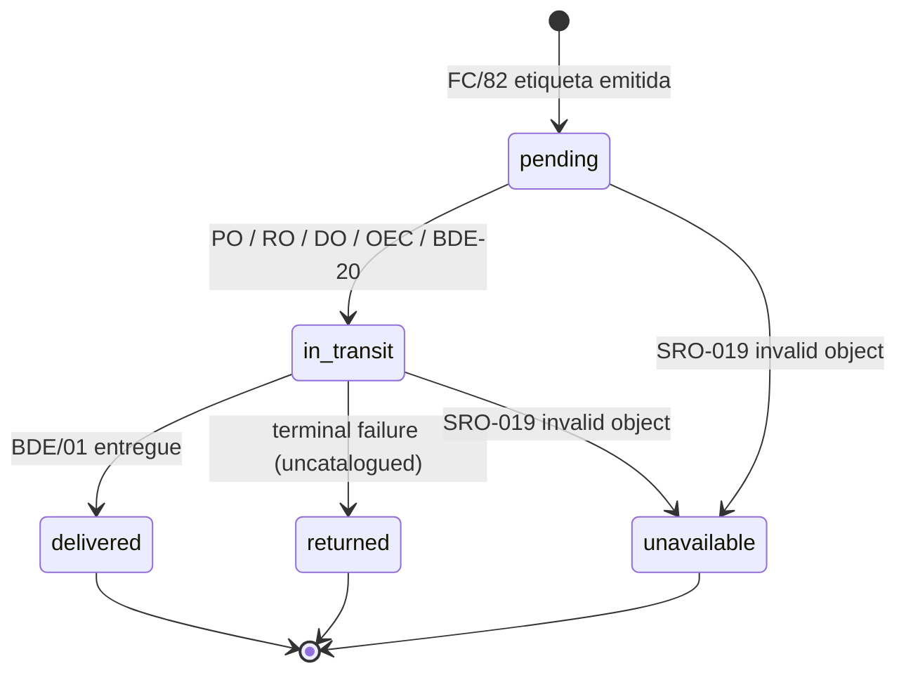
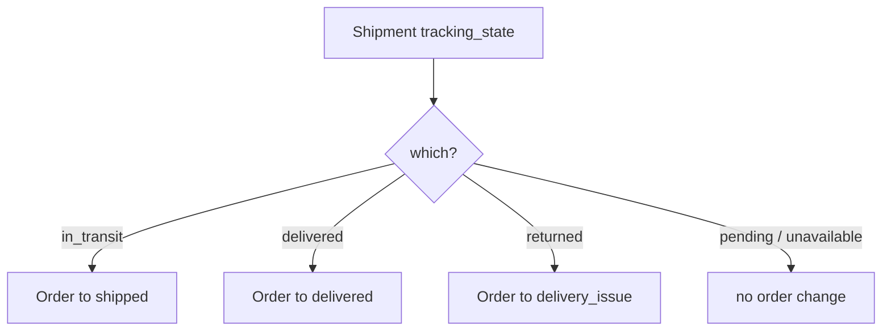
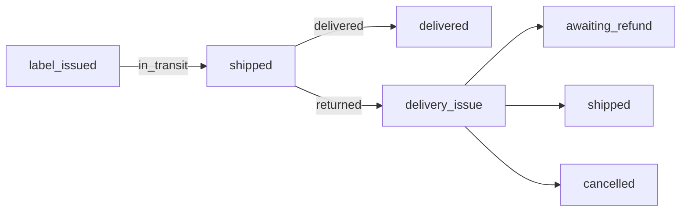

# Shipment tracking → Order status

How the Correios poll moves an order forward. There are **two state machines**: the
**Shipment** `tracking_state` (driven by rastro events) feeds the **Order** `status`
(driven by the shipment).

## Pipeline

## 1. Shipment `tracking_state`

Enum on `Shipment`: `pending(0) in_transit(1) delivered(2) returned(3) unavailable(4)`.
Final states stop the poll (`FINAL_TRACKING_STATES`): `delivered`, `returned`, `unavailable`.

`Shipping::TrackingUpdate#derive_state` reads the **full** event history each poll:

- `delivered` if any event signals delivered (`BDE/01`)
- `returned` if any event signals returned (no code mapped yet)
- `in_transit` if any event "moved" (any non-label event)
- otherwise `pending` (only the label `FC/82` so far)

`unavailable` is set by the `SRO-019` (invalid object) path in `SyncShipmentJob`, not by an event.

## 2. Event code → signal (`EVENT_SIGNALS`)

| code/type | descrição (Correios) | signal | effect |
|---|---|---|---|
| `FC/82` | Etiqueta emitida | `label_issued` | stays `pending` |
| `PO/01` | Objeto postado | `in_transit` | → `in_transit` |
| `RO/01` | Objeto em transferência | `in_transit` | → `in_transit` |
| `DO/01` | Objeto em transferência | `in_transit` | → `in_transit` |
| `OEC/01` | Saiu para entrega ao destinatário | `in_transit` | → `in_transit` |
| `BDE/01` | Objeto entregue ao destinatário | `delivered` | → `delivered` |
| `BDE/20` | Não entregue, carteiro não atendido (tentativa) | `in_transit` | → `in_transit` |

Anything **not** in the table is still **saved** (with its full raw payload) and **shown**
in the timeline, treated as generic movement (→ `in_transit`), and logged as
`[correios-rastro] unmapped event ...`. `TrackingUpdate.uncatalogued_codes` lists those so
they can be catalogued.

## 3. Shipment → Order (`OrderProgress`)

`Shipping::OrderProgress.apply(shipment)` runs after each sync and maps the resolved
`tracking_state` onto the order, walking the linear leg `label_issued → shipped → delivered`
one `OrderStatusChange` at a time:

| tracking_state | order goes to |
|---|---|
| `in_transit` | `shipped` |
| `delivered` | `delivered` |
| `returned` | `delivery_issue` |
| `pending` / `unavailable` | no change |

Guard-driven and idempotent: an order already at/past the target, or off the leg
(`cancelled`, `awaiting_refund`, …), is left untouched. Transitions are `automatic: true`.

## 4. Order status leg driven by the poll

`label_issued` is reached earlier by the pré-postagem label saga, not by the poll.
`delivery_issue` resolutions (`awaiting_refund` / `shipped` / `cancelled`) are operator actions.

## 5. Worked example

Order `PG-202606225119` / object `AD601305115BR`:

`FC/82 → PO/01 → RO/01 → RO/01 → DO/01 → OEC/01 → BDE/20`

- Shipment: `in_transit` (latest status "Objeto não entregue - carteiro não atendido").
- Order: `shipped`.
- Still polling (not a final state).

## `BDE/20` is transient, by design

`BDE/20` is a failed delivery **attempt** ("será realizada nova tentativa de entrega"). It is
mapped to `in_transit`, so it keeps the shipment in transit and the order at `shipped`. It
never marks the order `delivered` or `delivery_issue`. The terminal failures (extravio /
"devolvido ao remetente") are the codes destined for `returned → delivery_issue`, and are
still uncatalogued.
